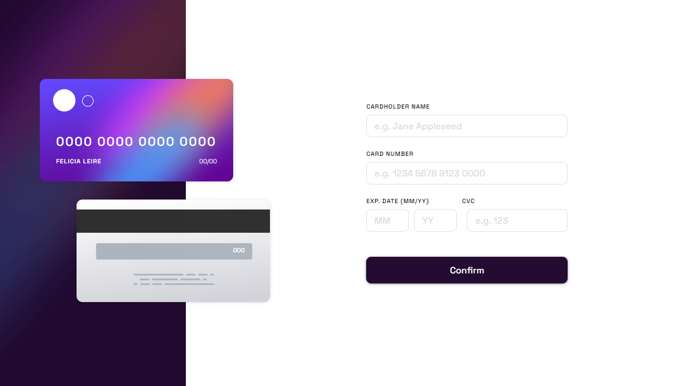
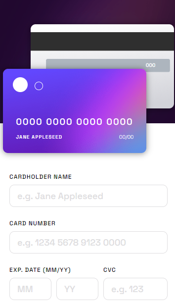
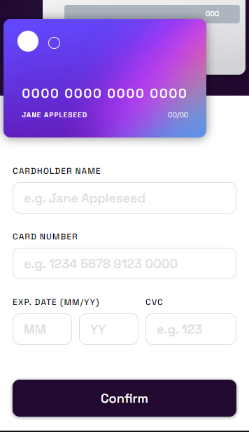
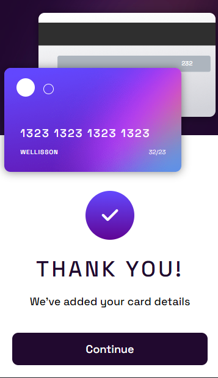
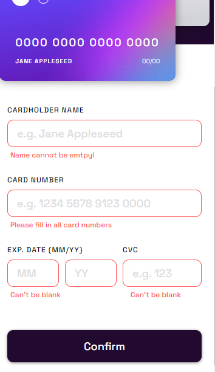

# Frontend Mentor - Interactive card details form solution


### Screenshot











### Links

- Solution URL: [](https://github.com/Wellissonb/interactive-card-details-form)
- Live Site URL: [](https://wellissonb.github.io/interactive-card-details-form/)

## My process

### Built with

- Semantic HTML5 markup
- CSS custom properties
- Flexbox
- Mobile-first workflow


### What I learned


```html
<h1>Some HTML code I'm proud of</h1>
```
```css
.proud-of-this-css {
  color: papayawhip;
}
```
```js
const proudOfThisFunc = () => {
  console.log('I learned how to leave an element with a visible display and then give it opacity 1, so that it occupies the space it needs and appears little by little. I used setTimeOut')

  container.style.display = 'flex'
  setTimeOut(()=>{
    container.style.opacity = '1'
  },1)

}
```
